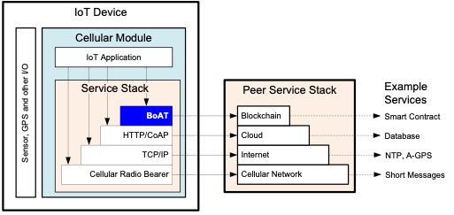
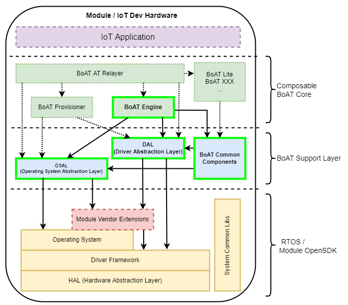

# BoAT Edge Overall Design

## Introduction

### Purpose
This document describes the overall system design of BoAT Edge (referred to as BoAT hereafter), including the architectural design, subsystem functionalities, internal and external interfaces, key processes, and key technical design descriptions. It aims to guide the overall design and testing strategy/specification of each subsystem. The intended readers of this document are BoAT Edge design personnel.

### Abbreviations
|Term   |Explanation                  |
|:----- |:--------------------------- |
|ABI    |Application Binary Interface |
|BE     |BoAT-Engine                  |
|BIA    |BoAT Infra Arch              |
|BoAT   |Blockchain of AI Things      |
|BPT    |BoAT-ProjectTemplate         |
|BSL    |BoAT-SupportLayer            |
|RLP    |Recursive Length Prefix      |
|RNG    |Random Numeral Generator     |
|RPC    |Remote Procedure Call        |
|TEE    |Trusted Execution Environment|
|RAM    |Random Access Memory         |

## BoAT Edge Design Objectives
As a blockchain application for the Internet of Things (IoT) edge, BoAT Edge should be designed with minimal changes required for easy and quick porting to various IoT devices or modules. The design of BoAT Edge follows the following principles:
+ Hierarchical design
+ Support for multiple blockchain protocols
+ Scalable design
+ Key security design
+ Provision of C language interface contract generation tools for different blockchains

## BoAT Edge Position in the Entire Blockchain Network
As a middleware connecting IoT devices and the blockchain, BoAT Edge's position in the entire interaction network is shown in Figure 3-1.
  
Figure 3-1: BoAT's position in the blockchain interaction network

## BoAT Edge Implementation Framework
The IoT blockchain application functionality provided by BoAT Edge is implemented through the BoAT Infra Arch (BIA) infrastructure architecture. The BIA infrastructure architecture is a design framework for IoT blockchain application development. It separates the blockchain application from the IoT platform through a layered design and integrates different application platforms under a unified application framework through bottom-layer abstractions, enabling support for multiple blockchains and cross-platform design within a defined scope.

  
Figure 4-1: BoAT Infra Arch overall architecture diagram

As shown in the diagram, the BIA architecture consists of four layers from top to bottom:

+ Application layer:  
The application layer, IoT Application, designs and implements IoT application functionalities based on the requirements of IoT device application scenarios. It achieves this by calling the APIs provided by the Composable BoAT Core layer and the BoAT Support Layer.

+ Composable BoAT Core layer:  
The Composable BoAT Core layer is the core component of BoAT. These components can be composed and deployed together. The diagram shows multiple BoAT components, including BoAT-Provisioner, BoAT-ATRelayer, and BoAT-Lite in dashed boxes, which are private components not yet open-sourced. The solid box represents the open-source component, BoAT-Engine.
  - BoAT Engine: Provides a multi-chain client API based on the BoAT-SupportLayer design for IoT applications. The application layer can implement IoT multi-blockchain application access through the API interface of BoAT Engine.
  - BoAT Provisioner: Provides an interface for managing initial key pairs for IoT devices, enabling personalized functionalities for IoT devices.
  - BoAT Lite: A signature service integrated with the BoAT Wake service.
  - BoAT AT Relayer: Extends the blockchain AT command and provides custom AT command definitions and general AT command forwarding for modules.

+ BoAT Support Layer:  
The BoAT Support Layer includes the operating system and driver abstraction layer, as well as the general components of BoAT. Through the abstraction provided by the BoAT-SupportLayer, it provides the application layer with a universal API interface based on different operating platforms. This allows the BoAT Infra Arch framework to achieve cross-platform application in the supported operating platforms. In other words, when an IoT device switches to a hardware platform supported by the BIA architecture, the application program only needs to select the appropriate platform, recompile it, and it can run in the new hardware environment.
  - OSAL: An abstraction layer that encapsulates operating system functionality, such as dynamic memory, tasks, semaphores, and queues.
  - DAL: An abstraction layer for hardware driver programs and module extensions, such as UART and virtual AT.
  - BoAT common components: The common libraries of BoAT, such as blockchain encryption libraries, RLP encoding, RPC services, key pair management, etc.

+ RTOS/Module OpenSDK Layer:  
The RTOS/Module OpenSDK Layer is the operating system layer of the IoT device, including the RTOS (Linux, FreeRTOS, Azure RTOS, etc.) used in the MCU or the SDK provided by the module vendor for OpenCPU applications. Apart from Module Vendor Extensions, the other parts are initially provided by the chip vendor.
  - HAL: Hardware abstraction layer.
  - Driver Framework: A framework for managing driver programs and providing a unified driver interface, such as read(), write(), ioctl().
  - Operating System: RTOS or Linux.
  - System Common Libs.: System-provided common libraries, such as C library, TLS library, MQTT/HTTP/TCP/IP library.
  - Module Vendor Extensions: Module vendor extensions, specific to the module vendor's additional functionalities on top of the chip, such as module-specific AT commands. These are not included in the MCU application.

BoAT-Engine and BoAT-SupportLayer are two open-source components of the BoAT Infra Arch framework.

The implementation components of the framework are shown in Figure 4-2:

  
Figure 4-2: BoAT Infra Arch implementation components diagram

BoAT-Engine provides multiple blockchain access interfaces based on the BoAT-SupportLayer. It consists of the Wallet, Protocol, Network, and Tools components.

- Wallet: Provides a wallet for IoT blockchain applications and corresponding transaction interfaces.
- Protocol: Implements various blockchain protocol interfaces.
- Network: Provides interfaces related to blockchain network information.
- Tools: Used for generating C language interfaces for smart contracts.

BoAT-SupportLayer provides OS API abstractions, driver abstractions, and general component interfaces. It enables cross-platform design features within the supported platforms of the BoAT Infra Arch.

- BoAT Common Components: Provides RPC services to the protocol layer, cryptographic algorithms, signing, and intermediate storage interfaces to the wallet interface, and services such as data format conversion and message encoding/decoding to all layers.
- OSAL: Abstracts system APIs of different platforms into unified generic interfaces, providing cross-platform design services for upper-layer applications. The implementation of the common components depends on the OSAL and DAL support of the corresponding platform.
- DAL: Abstracts drivers and specific functionalities of different platforms into unified generic interfaces, providing cross-platform design services for upper-layer applications.

### BoAT-Engine
#### Overview

BoAT-Engine is located at the top layer of the blockchain application interface, providing access to various blockchains for IoT applications. BoAT-Engine includes the following interface components:
+ Wallet Interface:
  * The wallet interface is the entry point of the BoAT SDK, and different blockchains have similar wallet entry points.
  * Different blockchains implement their own wallet entry points and corresponding wallet transactions. Each blockchain provides a set of transaction interfaces with similar functionality but different implementations.
+ Protocol Interface:
  * Application interfaces for different blockchain protocols, with different protocols for different blockchains.
+ Network Interface:
  * Provides interfaces related to blockchain network information, including blockchain node types, connection methods, role types, and other blockchain network-related information.
+ Tools Interface:
  * Used for generating C language interfaces for smart contracts.

The interfaces of BoAT-Engine are supported by the BoAT-SupportLayer. For a description of the BoAT-SupportLayer, please refer to [BoAT-SupportLayer](#BoAT-SupportLayer).

The detailed composition of BoAT-Engine is shown in Figure 4-3:

Figure 4-3: Internal composition of BoAT-Engine

#### Wallet Blockchain Wallet Interface
The blockchain wallet consists of two parts: the wallet interface and the transaction interface, which respectively implement blockchain wallet management and blockchain transaction management.

##### Wallet Interface
###### Data structures and function implementations of the wallet interface
The wallet is a container that stores not only the necessary information for accessing the blockchain but also a key pair structure~~management system~~ and the **blockchain network information structure**.

In the data structure of the wallet, the following elements should be included at least:
  + Account private key
  + Blockchain network information

In addition to the required elements, the data structure of the wallet can optionally include:
  + Account address

The wallet should implement the following functions:
  + BoAT-Engine initialization
  + BoAT-Engine deinitialization
  + Wallet creation
  + Wallet deletion

 ###### Wallet Interface Function Implementation Summary
####### BoAT-Engine Initialization/Deinitialization
+ BoAT-Engine Initialization:
Before using the BoAT SDK, BoAT-Engine initialization should be performed. The interface includes the following:
  1. Global resource initialization:
If some third-party libraries used by the SDK require initialization before calling, the initialization should be performed here, such as the cjson and curl libraries used by the *protocol* layer.
+ SDK Deinitialization:
After using the BoAT SDK, SDK deinitialization should be performed to release resources. The interface includes the following:
  1. Global resource deinitialization:
If some third-party libraries used by the SDK require deinitialization before calling, the deinitialization should be performed here, such as the cjson and curl libraries used by the *protocol* layer.

####### Wallet Operations
+ Wallet Initialization:
This interface is used to create a new wallet or read an existing wallet. The interface includes the following:
  1. Create a new wallet or read an existing wallet based on the input parameters.
  2. Perform wallet initialization for a specific blockchain based on the input parameters, such as performing Ethereum wallet initialization or PlatONE wallet initialization.

+ Wallet Deinitialization:
Release the system resources used during wallet initialization.

##### Transaction Interface
###### Data Structures and Function Implementations of Wallet Transactions
A transaction is a signed message that is propagated through the blockchain network and recorded on the blockchain. The transaction interfaces provided by different blockchains have similar functionalities.

For Ethereum/Polygon/PlatON/PlatONE/FISCO BCOS/Venachain:

A transaction should include at least the following elements:
+ Wallet data structure
+ Transaction identifier
+ Transaction message required

The transaction interface should provide the following functionalities:
+ Wallet initialization
+ Wallet deinitialization
+ Account balance query
+ Transaction initialization
+ Send transaction
+ Query transaction receipt
+ Stateless message call

###### Summary of Ethereum/Polygon Transaction Interface Function Implementation
+ Wallet Initialization:
  The interface includes the following:
  1. Set the blockchain contract address.
  2. Set whether the transaction specifies the chain ID.
  3. Set the chain ID.

+ Wallet Deinitialization:
  The interface includes the following:
  1. Clear private key information.
  2. Release blockchain network information resources.
  3. Call the web3 interface provided by the protocol layer: web3 interface deinitialization.

+ Account Balance Query:
  The interface includes the following:
  1. Prepare the message information required for account balance query.
  2. Call the web3 interface provided by the protocol layer: get account balance.

+ Transaction Initialization:
  This interface mainly initializes the fields in the transaction structure. In the Ethereum transaction structure, in addition to the v, r, and s fields of the signature, there are six fields: nonce, gasPrice, gasLimit, recipient, value, and data. Please note that the setting of the nonce field of the transaction is not implemented in this interface, but is set at the time of transaction sending, because the user may create multiple transaction messages simultaneously, and the order in which these messages are sent to the blockchain network is not guaranteed. It should also be noted that the nonce and gasPrice fields should be obtained from the blockchain by calling the corresponding web3 interface provided by the protocol layer. This method requires network access and will generate some network traffic.
  The interface includes the following:
  1. Set the GasPrice field of the transaction.
  2. Set the GasLimit field of the transaction.
  3. Set the Recipient field of the transaction.
  4. Set the Value field of the transaction.

+ Send Transaction:
  The interface includes the following:
  1. Check the synchronous/asynchronous flag (if any).
  2. If flagged as synchronous, call the raw transaction interface provided by the protocol layer: send raw transaction synchronously.
  3. If flagged as asynchronous, call the raw transaction interface provided by the protocol layer: send raw transaction asynchronously.

+ Query Transaction Receipt:
  The interface includes the following:
  1. Prepare the message information required for querying the transaction receipt.
  2. Call the web3 interface provided by the protocol layer "get transaction receipt" every specified time until the timeout is triggered.
  3. Return the query result.

+ Send Ether:
  The interface includes the following:
  1. Set the nonce field of the transaction.
  2. Set the value field of the transaction.
  3. Set the data field of the transaction.
  4. Execute the transaction sending.

+ Stateless Message Call:
  The interface includes the following:
  1. Prepare the message information required for stateless message call.
  2. Call the web3 interface provided by the protocol layer "blockchain stateless call".

###### Summary of PlatON Transaction Interface Function Implementation

Compared to Ethereum, PlatON has the following differences:

1. Different address formats:
   PlatON has added an additional address format similar to Bitcoin's Bech32 format on top of Ethereum. Therefore, when initializing a transaction, in addition to the required Ethereum parameters, it is also necessary to set the HRP (Human-readable parts) of the address. The wallet will automatically use the specified address format when making RPC calls.

2. Different function names for RPC calls:
   There is no difference for BoAT SDK users.

3. Specific blockchain ID requirement for PlatON:
   EIP-155 describes two data formats that can be used for transactions, but PlatON only supports one. Please refer to the [raw transaction interface description](#raw-transaction接口简述) for more details.

When designing the data structure and code implementation for PlatON, it is important to consider inheritance and code reuse. This helps to reduce code complexity and facilitate maintenance. Although PlatON's transaction structure is similar to Ethereum's, there is a need for Bech32 format addresses in some RPC commands. Therefore, in the data structure design, two additional fields for storing Bech32 format addresses are added. One possible design approach is shown in Figure 4-4:

  
Figure 4-4: Possible design approach for PlatON data structure

Figure 4-4 illustrates a possible design approach for PlatON's data structure. It is important to note that the two additional address fields for PlatON should be placed at the end of the data structure without compromising the integrity of the reusable Ethereum data structure. If the integrity of the Ethereum data structure is compromised, it will render the related implementation methods in Ethereum unusable.

###### Summary of PlatONE Transaction Interface Function Implementation

The differences between PlatONE and Ethereum are as follows:

+ Transaction Initialization:
  In addition to the initialization steps described for Ethereum, PlatONE also requires:
  1. Setting the transaction type field.

As mentioned earlier, the differences between PlatONE and Ethereum are minimal. When designing the data structure and code implementation for PlatONE, it is important to consider inheritance and code reuse. This helps to reduce code complexity and facilitate maintenance. For example, in terms of the composition of the transaction structure, PlatONE's transaction structure has an additional transaction type field compared to Ethereum. Therefore, in the data structure design, one possible approach is shown in Figure 4-5:

  
Figure 4-5: Possible design approach for PlatONE data structure

Figure 4-5 illustrates a possible design approach for PlatONE's data structure. It is important to note that the transaction type field for PlatONE should be placed at the end of the data structure without compromising the integrity of the reusable Ethereum data structure. If the integrity of the Ethereum data structure is compromised, it will render the related implementation methods in Ethereum unusable.
